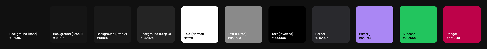
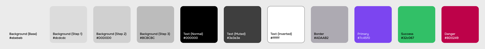

<!--
  Community members who would like to propose an idea or feature should begin
  by creating a GitHub Discussion. See the repo README.md for more info.

  To use this template: create a new, empty file in the repo under `proposals/${ID}.md`.
  Replace `${ID}` with the official accepted proposal ID, found in the GitHub Issue
  of the accepted proposal.
-->

**If you have feedback and the feature is released as experimental, please leave it on the Stage 3 PR. Otherwise, comment on the Stage 2 issue (links below).**

- Start Date: 2024-10-01
- Reference Issues:  [withstudiocms/studiocms Issue #304](https://github.com/withstudiocms/studiocms/issues/304)
- Implementation PR: [withstudiocms/studiocms PR #333](https://github.com/withstudiocms/studiocms/pull/333)
- Stage 2 Issue: [withstudiocms/studiocms Discussion #294](https://github.com/withstudiocms/studiocms/discussions/294)
- Stage 3 PR: [withstudiocms/roadmap PR #1](https://github.com/withstudiocms/roadmap/pull/1)

# Summary

A proposal to redesign (and, if necessary, rewrite parts of) the StudioCMS dashboard.

## Champions

- Louis Escher ([@louisescher](https://github.com/louisescher))
- Adam Matthiesen ([@Adammatthiesen](https://github.com/Adammatthiesen))

## Overview / Motivation

The current StudioCMS dashboard, while functional, leaves a lot to be desired in terms of UI/UX design. Since this project aspires to be the default CMS for all Astro projects big and small, a better dashboard is needed to facilitate the needs of multiple types of users - be it developers or office workers.

### Principles:
- The dashboard should function on all devices.
- The dashboard should provide an easy way to manage StudioCMS for everyone, not just developers
- The dashboard should be easy to get used to
- The dashboard should provide functionality that can be extended as needed, in future updates and with plugins

## Figma Prototype

I have created a [Figma board](https://www.figma.com/design/9ilUXDWbBVEv6FMSMzUTmf/StudioCMS-Concept?m=auto&t=8EDyorFtqAOuojKZ-1) and a matching [Figma prototype](https://www.figma.com/proto/9ilUXDWbBVEv6FMSMzUTmf/Untitled?page-id=0:1&node-id=12-323&node-type=frame&viewport=582,489,0.07&t=SN8G0ZTJgFZED3I5-1&scaling=scale-down&content-scaling=fixed&starting-point-node-id=25:1543&disable-default-keyboard-nav=1&hide-ui=1) that can be used to see an interactive early version of this concept. 
## Things that are needed for this to work
- The plugin definition syntax needs to be reworked in order for plugins to be able to:
	- Transform content before it is saved in the database
	- Add cards to the homepage to display info at a glance
	- Create their own settings pages based on a template/fields syntax that gives them access to input components
	- Allow plugins to add their own page content fields & implementations
- [Issue #293 (Optional diff option)](https://github.com/astrolicious/studiocms/issues/293) would need to be implemented
- The permissions system would need to be overhauled:
	- A new `Owner` permission, given to the person who did the onboarding
- A new invite system to add new users via a link
- A shared component library for all inputs, modals, layouts etc.
- The onboarding logic would need to be reworked somewhat to allow for OAuth accounts to be added during setup
- Some changes would need to be made to the current markdown editor

**Feedback on design & functionality would be greatly appreciated! 😊**

*Note: This UI change has been discussed on the [Astrolicious Discord Server](https://chat.astrolicious.dev/) in the `#studiocms` channel for a few days now. Refer to that for suggestions that have already been made.* 

## Amendments

### Amendment 1

#### Login Page Prototype

We (the community & I) have created a prototype for a login page that you can view in your browser:
- https://louisescher.github.io/studiocms-login-test/ (Webpage)
- https://github.com/louisescher/studiocms-login-test (GitHub Repo)

Contributions for new StudioCMS-specific backgrounds or new looks (better glass material / outline) are appreciated. Just open a PR on the repo. A guide can be found in the `README.md` file. If you find any bugs / performance issues, please open up an issue on the repo.

#### Palettes

Here's the palette found in the prototype, plus a light mode version:

### Amendment 2

#### Double-Sidebar on Mobile POC

@jdtjenkins asked me to create a mobile version of the double sidebar, so here you go:

- [GitHub Pages deployment](https://louisescher.github.io/studiocms-sidebar-poc/)
- [GitHub repo](https://github.com/louisescher/studiocms-sidebar-poc)

The general idea goes as follows:

1. When visiting the content management page on mobile, you start with seeing the "inner" sidebar
2. You select a folder to navigate into, and eventually click on a page
3. The sidebar gets hidden and the editing content is revealed to you
4. At any time, you can choose a different page via the hamburger menu in the top left corner 
*Side note, might wanna have a modal warning about leaving the site without saving changes*
5. You either select a different page or head back to the "outer" sidebar with the arrow button

A couple things to note about the POC:

- A few animations are broken in the POC, I expect them to work properly once this is a well implemented system and not just some thrown-together HTML
- After talking with @jdtjenkins, we agreed that it makes the most sense if the sidebar extends to full size on mobile devices, to cover the whole screen. This is something we will implement in the actual dashboard, but not in the POC.